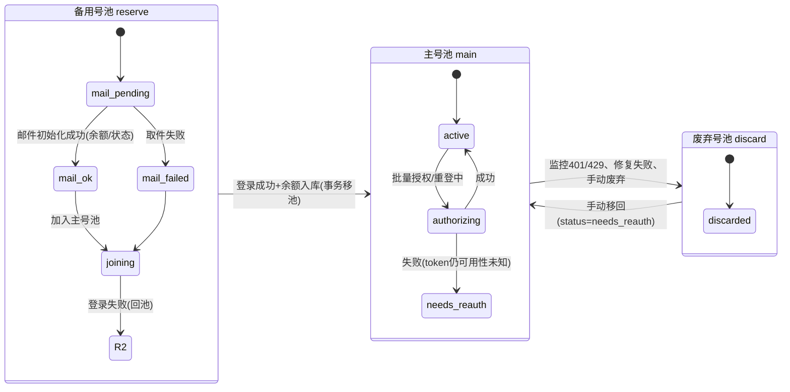

# 04-04 号池模块（三级号池）

## 1. 总览状态机

单表 `accounts`，`pool` + `status` 两级状态。所有流转必须走 `pools.js` 提供的事务函数（带 `WHERE pool=...` 乐观锁），禁止散落的裸 UPDATE。



各池 `status` 枚举：

| pool | status | 含义 |
|---|---|---|
| reserve | `mail_pending` / `mail_failed` / `joining` | 导入待初始化 / 取件失败 / 加池登录中 |
| main | `active` / `authorizing` / `needs_reauth` | 可用 / 授权任务进行中 / token 失效待重新授权 |
| discard | `discarded` | 终态（可移回） |

> 余额与封禁作为**数据字段**（`balance / banned`）而非状态，任何池都可见。

## 2. 备用号池导入（POST /api/v1/accounts/import）

### 2.1 输入格式

沿用 v1 Outlook 四段格式（outlook-mail.mjs:43-74）：

```
邮箱----邮箱密码----clientId----refresh_token
```

校验：邮箱格式；clientId 必须是 UUID；refresh_token 长度 ≥100；四段齐全。

### 2.2 三重查重（返回给前端做弹窗，不直接报错）

| 检查 | 命中处理 | 响应字段 |
|---|---|---|
| ① 本批次内重复 | 保留首行，其余跳过 | `duplicates_in_batch: [email]` |
| ② 已在备用号池 | 跳过（更新凭据） | `duplicates_in_reserve: [email]` |
| ③ 已在主号池 | **跳过并弹窗提示**（需求原文：显示「xxx.xxx,xxx 账户已在主号池中」） | `duplicates_in_main: [email]` |
| ④ 已在废弃号池 | 默认跳过，弹窗可选「仍然导入」（请求带 `force_discard=true` 时导入并清废弃记录） | `duplicates_in_discard: [{email, reason}]` |
| ⑤ 远端 sub2api 已有（若已配置且可连通） | 默认跳过（可 `force_remote=true` 导入） | `duplicates_remote: [email]` |

响应（一次导入全部结果，前端弹窗展示后再决定是否 force 重导）：

```jsonc
{
  "created": 25,
  "accounts": [{ "id": 101, "email": "a@b.com", "status": "mail_pending" }],
  "duplicates_in_batch": ["c@b.com"],
  "duplicates_in_reserve": ["d@b.com"],
  "duplicates_in_main": ["e@b.com", "f@b.com"],
  "duplicates_in_discard": [{ "email": "g@b.com", "reason": "rate_limited_429" }],
  "duplicates_remote": ["h@b.com"],
  "invalid_lines": [{ "line": 9, "reason": "clientId 不是 UUID" }]
}
```

弹窗文案（前端）：`e@b.com、f@b.com 账户已在主号池中`——用中文顿号连接，超 5 个折叠为「等 N 个账户」。

### 2.3 入库

- `pool='reserve'`, `status='mail_pending'`, `imported_at=now`。
- Outlook 凭据加密入 `credentials_enc`（结构见 02 §3.1）。
- `INSERT account_events(type='imported', detail={source:'manual'})`。
- **异步**触发邮件初始化（逐个，并发 3，队列内串行）。

### 2.4 邮件初始化（mail-init.js，复用 core/outlook-mail.mjs）

每个账号（也可手动触发 `POST /api/v1/accounts/:id/refresh-mail`）：

1. `status='mail_pending'` → 进行中标记（`mail_status='checking'`）。
2. 调 `fetchReserveAccountMessages`（POST 取件端点，maxMessages=10，无发件人过滤）。
3. 解析：
   - 初始余额：`extractBalanceFromMessages` 正则 `/we[\s']*ve\s+added\s+([\d,]+(?:\.\d+)?)\s+credits\b/i`，**balance = credits / 25**，取最近一封 → `initial_balance / has_balance=1`。
   - 封禁：`isAccountBannedFromMessages` 关键字 → `banned=1, banned_reason='邮件命中封禁关键词'`。
4. 成功 `mail_status='ok'`；取件失败 `mail_status='fetch_failed'` + `mail_error`；`last_checked_at=now`；写 `account_events(type='mail_checked')`。

列表接口返回 `{email, initial_balance, has_balance, banned, banned_reason, mail_status, mail_error, imported_at, last_checked_at}`。**「有初始余额」的账号在前端挑号时排前**（挑号策略沿用 v1 `pickNextReserveAccount`：idle 且未封禁，有余额优先，其次导入顺序——v2 用于自动补号场景）。

## 3. 加入主号池（POST /api/v1/accounts/join-main）

请求 `{ ids: [101, 102] }`（单选传一个元素）。逐账号校验 + 串行处理（邮箱级互斥靠 `idx_jobs_active_per_account` 与状态 CAS）：

### 3.1 前置校验（拒绝并跳过，响应 `skipped:[{id, reason}]`）

- `pool != 'reserve'` → `ACCOUNT_STATE_INVALID`
- `status == 'joining'` → `CONFLICT`（已在进行）
- `banned=1` → 拒绝（弹窗确认可强制？**不提供**：封禁号不登录，先在备用池处理）
- 无 `credentials.outlook` → 拒绝（邮箱验证码登录必须有取件凭据）

### 3.2 流程（与 v1 `joinReserveToPool` 语义一致，console-server.mjs:4635-4720）

1. **再拉一次邮件**确认未封禁（防导入后新封禁）：
   - 命中封禁 → `banned=1` + `account_events`，跳过，响应中标记。
   - 顺带刷新 `initial_balance`。
2. 创建 login 任务（jobs 引擎）：
   - `type='login'`；凭据 = Outlook（email_otp 登录路径，登录期验证码由 auto-input 的 Outlook 轮询自动提交，03 §8.4）。
   - 代理 = `pickRandomAliveProxy()`。
   - 同事务：`status='joining'` + INSERT job。
3. 任务完成回调（引擎发出 `account.login_finished`）：
   - **成功**：解析 `result_saved` 产物 → `tokens_enc` 入库；调 `chatgpt-credits` 查实时余额（失败不阻断，`balance_error` 记录）；单事务移池：`pool='main', status='active', last_login_at=now, balance=...` + 保留 `initial_balance`；`account_events(type='join_succeeded')`；删除该账号 checkpoint。
   - 若 sub2api 配置中 `join_auto_upload=true`（可选开关，默认 false）→ 紧接着自动走 §5 上传管线。
   - **失败**：回 `status='mail_failed'`（`mail_error=登录失败原因`）+ `account_events(type='join_failed', detail={error, job_id})`。错误含永久封禁关键字（03 §9）→ 直接移废弃池 `login_failed`。

响应 `202 { started: [101], skipped: [{id:102, reason:"banned"}] }`，进度看任务中心/备用池列表轮询。

## 4. 主号池批量操作

### 4.1 批量授权（POST /api/v1/accounts/batch-authorize）

`{ids[]}`。对每个 `pool='main'` 账号：

- `tokens_enc.refresh_token` 存在 → 先建 `type='refresh'` 任务（快，免登录）；失败（`REFRESH_TOKEN_INVALID`）自动转 `type='login'`（凭据齐全时）。
- 无 refresh_token → 直接 login 任务（凭据不全的账号跳过并提示）。
- `status='authorizing'`（CAS：`WHERE pool='main' AND status IN ('active','needs_reauth')`）。
- 并发受任务引擎槽位约束；对应 v1 `reauthorize-batch` 语义（console-server.mjs:497-510）。

### 4.2 批量获取余额（POST /api/v1/accounts/batch-refresh-balance）

`{ids[]}`（空 = 全部主号池）。对每个账号：

1. 读 `tokens_enc`；随机选存活代理（需求：请求 OpenAI 接口的操作都走代理池）。
2. `GET {CHATGPT_BASE}/backend-api/wham/usage`（Bearer access_token，03 §6）。
3. 401/403 → refresh_token 换新（新 token 回写 `tokens_enc`）→ 重试一次。
4. 成功：`balance=json.credits.balance, balance_checked_at=now, balance_error=null`。
5. 失败：`balance_error` 记录（不阻断批次）。
6. `account_events(type='balance_refreshed')`。

限流：并发 ≤5，账号间 500ms 间隔可配。响应 `{refreshed: n, failed: [{id, error}]}`。

### 4.3 批量上传 sub2api（POST /api/v1/accounts/batch-upload-sub2api）

`{ids[], options?}`（options 覆盖 `sub2api.config.upload_defaults` 一次性）。管线细节见 [05-sub2api模块.md](./05-sub2api模块.md)。要求账号 `tokens_enc` 非空（`needs_reauth` 也可上传——用现有 token，但前端提示建议先授权）。

### 4.4 其他

- 导出：`GET /api/v1/accounts/export?ids=...&format=sub2api|source`（sub2api = 合并导入文件下载；source = v1 的 `邮箱----密码----API----2FA` 原始格式，从 `credentials_enc` 还原）。
- 删除：`POST /api/v1/accounts/batch-delete {ids[]}` → 事务删行（级联 events/jobs 引用置 NULL）+ 删 checkpoint/results 文件 + 删凭据。
- 移废弃：`POST /api/v1/accounts/batch-discard {ids[], reason?: 'manual'}` → 事务流转 + `discard_detail='手动废弃'`。

## 5. 废弃号池

### 5.1 进入来源

| 来源 | discard_reason | 触发方 |
|---|---|---|
| sub2api 账号错误含 401/deactivated/banned/suspended（分类正则见 sub2api 配置） | `banned_401` | 监控巡检 |
| sub2api 账号错误含 429/rate limit/too many requests | `rate_limited_429` | 监控巡检 |
| 自动修复连续失败 `max_repair_attempts` 次 | `repair_failed` | 监控巡检 |
| 加入主池登录时返回永久封禁 | `login_failed` | 任务引擎回调 |
| 手动废弃 | `manual` | 前端按钮 |

移池事务（由 sub2api 监控/手动按钮调用）：`UPDATE ... SET pool='discard', status='discarded', discard_reason=?, discard_detail=?(<sub2api 原始错误截断2000字符), discarded_at=now WHERE id=? AND pool='main'` + `account_events(type='moved_to_discard')`。**不移除 sub2api 侧账号**（是否远端禁用/删除由用户在 sub2api 自行处理；可在设置中开启 `monitor.pause_on_discard=true` 时顺带调 sub2api 把账号置 schedulable=false，默认 true）。

### 5.2 恢复（POST /api/v1/accounts/:id/restore）

discard → main，`status='needs_reauth'`（token 大概率已失效，先批量授权）。`account_events(type='restored')`。

### 5.3 展示字段

`email / discard_reason(徽章) / discard_detail(悬浮) / balance(废弃时余额) / discarded_at / 操作(移回主池·彻底删除)`。

## 6. 列表接口

`GET /api/v1/accounts?pool=reserve|main|discard&q=&status=&banned=&has_balance=&page=&page_size=&sort=`：

- `q` 模糊匹配 email。
- 返回字段按池裁剪（reserve 不回 tokens 相关；敏感凭据永不出库）。
- 附 `stats`：当前池各状态计数（前端徽章）。

分页 `{items, total, page, page_size}`；排序白名单（`created_at/email/balance/last_login_at/discarded_at`）防注入。

## 7. 与 v1 的行为对照

| v1 行为 | v2 行为 | 理由 |
|---|---|---|
| 备用池 join 成功后立即上传 sub2api 并从备用池删除 | 移入主号池统一管理；上传为独立动作（可开 join_auto_upload 恢复旧行为） | 需求：主号池是上传 sub2api 的操作面 |
| 无废弃池概念，错误账号靠监控自动重登 | 401/429/修复失败自动废弃 + 手动废弃/恢复 | 需求 3 |
| 余额只在任务完成后查一次 | 定期/手动批量刷新，token 自动轮换回写 | 需求：批量获取余额 |
| 导入查重：备用池内 + 本地任务 + 远端 | 备用池内 + 主号池(弹窗) + 废弃池(可选) + 远端(可选) | 需求：与主号池查重弹窗 |
