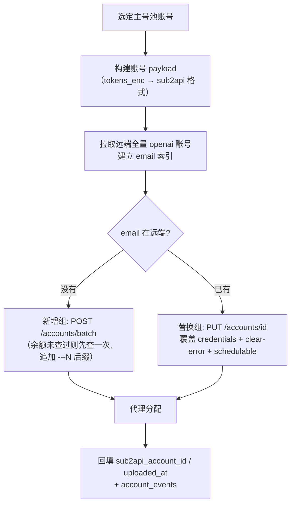
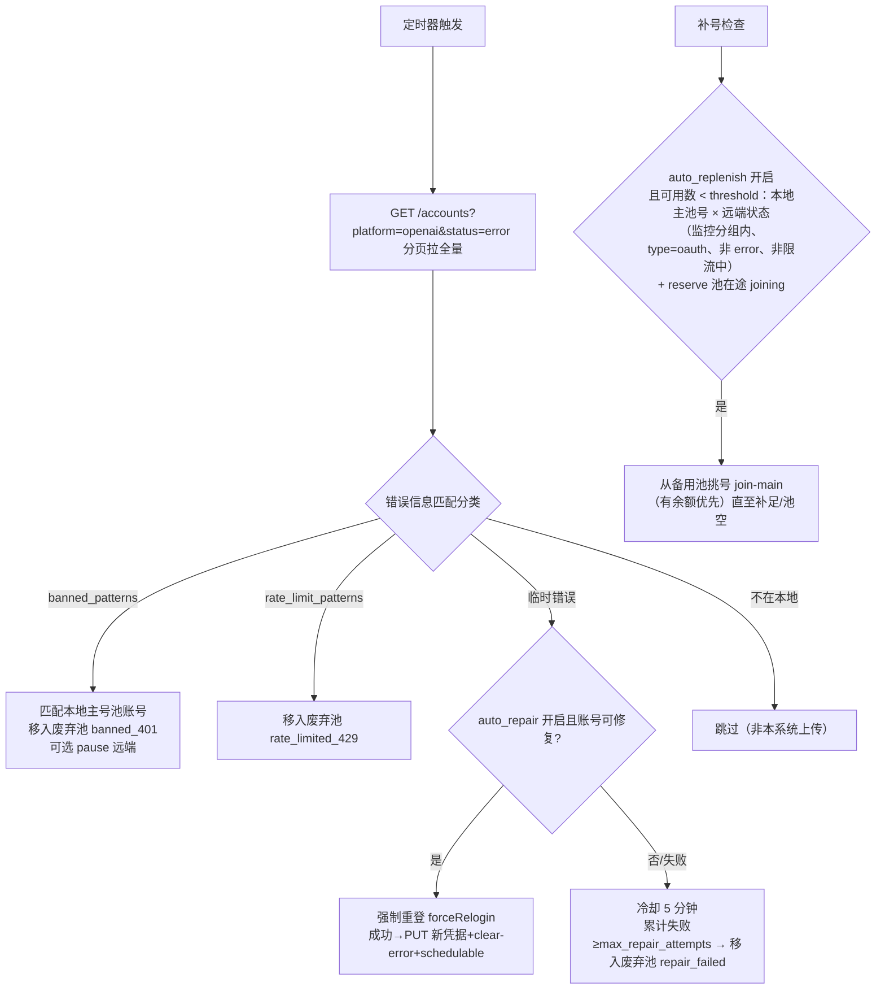

# 04-05 sub2api 模块

## 1. 职责

- sub2api 后端连接配置（base_url + 管理员密钥，加密存储、读取脱敏）。
- 上传管线：主号池账号 → sub2api（**远端没有的新增、已有的替换凭据**）。
- 上传选项：禁用 5h/7d 自动暂停、并发数、优先级、负载因子、模型白名单、随机分配 sub2api 内已有代理。
- 号池监控巡检（默认 5 分钟）：发现 401/429 → 移废弃池；临时错误 → 自动重登修复；低于阈值 → 自动补号。

## 2. 客户端协议（client.js）

配置结构见 [02-数据库设计 §3.3](../02-数据库设计.md)。全部走 admin API，请求头 `x-api-key: <admin_key>`，超时 120s（v1 console-server.mjs:2720-2729）。

| 方法 | 端点 | 用途 |
|---|---|---|
| GET | `/api/v1/admin/groups/all?platform=openai` | 号池分组列表 |
| GET | `/api/v1/admin/proxies/all` | 代理列表（含 status） |
| GET | `/api/v1/admin/accounts?page=N&page_size=100&platform=openai[&status=error]` | 分页拉账号（最多翻 1000 页） |
| GET | `/api/v1/admin/accounts/{id}` | 单账号（404 = 已删除） |
| POST | `/api/v1/admin/accounts/batch` | 批量新建，头 `Idempotency-Key: tosub2-upload-<uuid>` |
| PUT | `/api/v1/admin/accounts/{id}` | 覆盖更新（替换凭据） |
| POST | `/api/v1/admin/accounts/{id}/clear-error` | 清除错误态 |
| POST | `/api/v1/admin/accounts/{id}/schedulable` | body `{"schedulable":true}` 恢复调度 |

> sub2api 账号对象中的邮箱提取顺序（v1 `sub2ApiAccountEmail` console-server.mjs:3168-3175）：`credentials.email` → `extra.email` → `name` 中正则抽邮箱。错误信息字段：优先 `error_message`，兼容 `last_error / message`（**分类器对多字段做拼接后再匹配**，正则可配置）。

## 3. 上传管线（upload.js）

### 3.1 输入

`POST /api/v1/accounts/batch-upload-sub2api { ids, options? }`；`options` 与 `sub2api.config.upload_defaults` 合并（请求级覆盖）。账号必须有 `tokens_enc`。

### 3.2 步骤



**payload 构建**（v1 `buildSub2ApiUploadPayload` console-server.mjs:2464-2634 的完整语义）：

```jsonc
// 单账号（新增组）
{
  "name": "oauth---<email>",              // 首次且已查余额 → "oauth---<email>---N"
  "platform": "openai",
  "type": "oauth",
  "credentials": {                         // 来自 tokens_enc
    "access_token": "...", "refresh_token": "...", "id_token": "...",
    "chatgpt_account_id": "us_...", "email": "..."
  },
  "extra": {
    ...账号 extra 原样保留（远端已有的 model_mapping 等不覆盖）,
    "auto_pause_5h_disabled": true,        // 仅勾选禁用 5h 时写入；不勾 = 不写该键
    "auto_pause_7d_disabled": true         // 同上，两键独立
  },
  "group_ids": [1, 3],                     // 配置了才写
  "concurrency": 10,                       // 可空 = 不写（保留远端/默认值）
  "load_factor": 1,                        // 可空
  "priority": 1,                           // 可空
  "model_mapping": {"gpt-5":"gpt-5"},      // 模型白名单勾选时（写入 credentials.model_mapping）
  "proxy_id": 2,                           // 见代理分配
  "status": "active",
  "schedulable": true
}
```

**替换组**（远端已有）：只 PUT `credentials`（+需要的 extra 键），随后 `clear-error` + `schedulable:true`；**不覆盖**远端已有的 name/group_ids/model_mapping 等非敏感配置（v1 行为，README 明确承诺过）。替换成功把远端 id 回填 `sub2api_account_id`。

**余额后缀**：新增组若 `balance_checked_at` 为空，上传前实时查一次余额；`N = Math.round(balance)`（v1 `formatCreditBalanceSuffix` console-server.mjs:3182-3186，balance 单位为美元≈credits/25 后的值，v1 语义为 credits/25 后再 round）。查询失败不阻断、保持原名。

### 3.3 代理分配（随机绑定最少，v1 语义不变）

条件：`options.proxy_id` 为空 且 `auto_select_proxy=true`：

1. `GET /proxies/all` 取全部 `status=active` 代理。
2. `GET /accounts?platform=openai` 全量统计每个 `proxy_id` 的绑定数。
3. **每个账号独立选当前绑定最少者，并列随机**；批量内本地计数 +1 实现整批均匀（v1 `selectLeastBoundSub2ApiProxy` console-server.mjs:3128-3166，冒烟测试 `test/proxy-autoselect-smoke.mjs` 固化契约）。
4. 手动 `proxy_id` 优先；都无 → payload 不含 `proxy_id`。

### 3.4 响应

```jsonc
{ "created": 12, "updated": 3, "failed": [{"id": 5, "email": "x@y.com", "error": "..."}],
  "updated_account_ids": [101, 102] }
```

## 4. 监控巡检（monitor.js）

配置见 02 §3.3 `monitor` 段。单实例互斥（进行中跳过本轮），间隔 `interval_minutes`（默认 5）。



要点（继承 v1 `runSub2ApiMonitor` console-server.mjs:2852-2984 语义并按新需求调整）：

- 只处理**所配分组**内的远端账号（未配分组=全部 openai 账号）。
- 自动修复资格（v1 `getAutoRepairEligibility` 3232-3242）：上次登录全自动（无人工输入）、凭据齐全（密码/TOTP/收码可用）、当前无活跃任务、`auto_repair_blocked=0`、不在冷却期。
- 永久性失败关键字（account_deactivated/deleted/suspended）→ `auto_repair_blocked=1` 永久跳过 + 直接移废弃池。
- 修复成功：新凭据 PUT 到远端（按 `sub2api_account_id` 定位，不新增账号）+ `clear-error` + `schedulable`。
- **移废弃池的动作全部经过号池模块的事务函数**（04-04 §5.1），保证审计与状态一致。
- 补号计数以**本地主池为准 × 远端实际状态**联合判断：已废弃但远端未删的号、他人上传的号、远端已删除的本地号都不计入；限流中（429）与 error（401）的号不计入；reserve 池在途 joining（有活跃任务）计入可用，防止在途期间重复触发。
- 补号并发：单轮最多同时发起 `min(3, 空缺数)` 个 join，其余等下一轮（避免任务槽被补号占满）。
- 补号挑号顺序可配置（取值同号池手动批量 `order` 枚举，04-04）：`replenish_upload_order` 主池库存上传顺序（默认 `balance_asc` 余额小优先）；`replenish_join_order` 备用池登录顺序（默认 `balance_desc` 有余额、金额大优先；按金额排序时余额未知的排最后）。
- 巡检结果写 `account_events` 并在 `GET /api/v1/sub2api/monitor` 暴露 `last_check_at / next_check_at / last_error / last_result{discarded, repairing, replenished}`。

## 5. 配置与连通性

- `GET /api/v1/sub2api/config` → 脱敏视图：`admin_key` 只回 `"sk-****abcd"`（尾 4 位）+ `has_key: true`；PUT 时 `admin_key` 留空/传 `****` = 不修改。
- `POST /api/v1/sub2api/test`：用当前（或请求体携带的）配置拉 `groups/all`，返回 `{ok, groups: n, latency_ms}` 或脱敏后的错误。
- `GET /api/v1/sub2api/groups|proxies`：代理远端列表（上传配置弹窗选分组/手动代理用）。
- `GET /api/v1/sub2api/remote-accounts?email=`：远端账号查询（主号池行内「远端状态」气泡）。

## 6. 安全要点

- `admin_key` 只存加密 settings；任何 API 响应、日志、任务日志不得出现明文（`sanitize.js` 强制）。
- 上传失败的错误信息回传前过一遍脱敏（去掉请求头/密钥片段）。
- 详见 [07-安全设计.md](../07-安全设计.md)。
